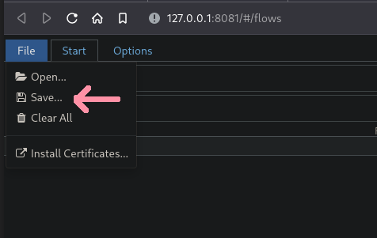
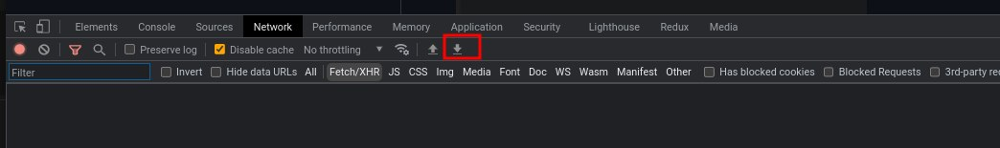

# mitmproxy2swagger


[](https://badge.fury.io/py/mitmproxy2swagger)
[](https://archlinux.org/packages/community/any/mitmproxy2swagger/)


https://user-images.githubusercontent.com/5400940/168086818-c48f60ab-3f95-42eb-b435-c8b1a6326b81.mp4


A tool for automatically converting [mitmproxy](https://mitmproxy.org/) captures to [OpenAPI 3.0](https://swagger.io/specification/) specifications. This means that you can automatically reverse-engineer REST APIs by just running the apps and capturing the traffic.

---
**🆕 NEW!**

Added support for processing HAR exported from the browser DevTools. See [Usage - HAR](#har) for more details.

---

## Installation

First you will need python3 and pip3.

```bash
$ pip install mitmproxy2swagger 
# ... or ...
$ pip3 install mitmproxy2swagger
# ... or ...
$ git clone git@github.com:alufers/mitmproxy2swagger.git
$ cd mitmproxy2swagger
$ docker build -t mitmproxy2swagger .
```

Then clone the repo and run `mitmproxy2swagger` as per examples below.

## Usage

### Mitmproxy

To create a specification by inspecting HTTP traffic you will need to:

1. Capture the traffic by using the mitmproxy tool. I personally recommend using mitmweb, which is a web interface built-in to mitmproxy.

    ```bash
    $ mitmweb
    Web server listening at http://127.0.0.1:8081/
    Proxy server listening at http://*:9999
    ...
    ```
    **IMPORTANT**

    To configure your client to use the proxy exposed by mitm proxy, please consult the [mitmproxy documentation](https://docs.mitmproxy.org/stable/) for more information.

2. Save the traffic to a flow file.

    In mitmweb you can do this by using the "File" menu and selecting "Save":
    
    

3. Run the first pass of mitmproxy2swagger:

    ```bash
    $ mitmproxy2swagger -i <path_to_mitmptoxy_flow> -o <path_to_output_schema> -p <api_prefix>
    # ... or ...
    $ docker run -it -v $PWD:/app mitmproxy2swagger mitmproxy2swagger -i <path_to_mitmptoxy_flow> -o <path_to_output_schema> -p <api_prefix>
    ```

    Please note that you can use an existing schema, in which case the existing schema will be extended with the new data. You can also run it a few times with different flow captures, the captured data will be safely merged.

    `<api_prefix>` is the base url of the API you wish to reverse-engineer. You will need to obtain it by observing the requests being made in mitmproxy.

    For example if an app has made requests like these:

    ```
    https://api.example.com/v1/login
    https://api.example.com/v1/users/2
    https://api.example.com/v1/users/2/profile
    ```

    The likely prefix is `https://api.example.com/v1`.

4. Running the first pass should have created a section in the schema file like this:

    ```yaml
    x-path-templates:
    # Remove the ignore: prefix to generate an endpoint with its URL
    # Lines that are closer to the top take precedence, the matching is greedy
    - ignore:/addresses
    - ignore:/basket
    - ignore:/basket/add
    - ignore:/basket/checkouts
    - ignore:/basket/coupons/attach/{id}
    - ignore:/basket/coupons/attach/104754
    ```

    You should edit the schema file with a text editor and remove the `ignore:` prefix from the paths you wish to be generated. You can also adjust the parameters appearing in the paths.

5. Run the second pass of mitmproxy2swagger:

    ```bash
    $ mitmproxy2swagger -i <path_to_mitmptoxy_flow> -o <path_to_output_schema> -p <api_prefix> [--examples]
    # ... or ...
    $ docker run -it -v $PWD:/app mitmproxy2swagger mitmproxy2swagger -i <path_to_mitmptoxy_flow> -o <path_to_output_schema> -p <api_prefix> [--examples]
    ```

    Run the command a second time (with the same schema file). It will pick up the edited lines and generate endpoint descriptions. 

    Please note that mitmproxy2swagger will not overwrite existing endpoint descriptions, if you want to overwrite them, you can delete them before running the second pass.

    Passing `--examples` will add example data to requests and responses. Take caution when using this option, as it may add sensitive data (tokens, passwords, personal information etc.) to the schema.

### HAR

1. Capture and export the traffic from the browser DevTools.

    In the browser DevTools, go to the Network tab and click the "Export HAR" button.

    
2. Continue the same way you would do with the mitmproxy dump. `mitmproxy2swagger` will automatically detect the HAR file and process it.

## Example output

See the [examples](./example_outputs/). You will find a generated schema there and an html file with the generated documentation (via [redoc-cli](https://www.npmjs.com/package/redoc-cli)).

See the generated html file [here](https://raw.githack.com/alufers/mitmproxy2swagger/master/example_outputs/lisek-static.html).

## License
MIT

